# EgoRecovery — Code & Visualization

## Response to Reviewer "2ftg" W1, Reviewer "tMkX" Q2 & W1

###  OOD human recovery under cluttered interference

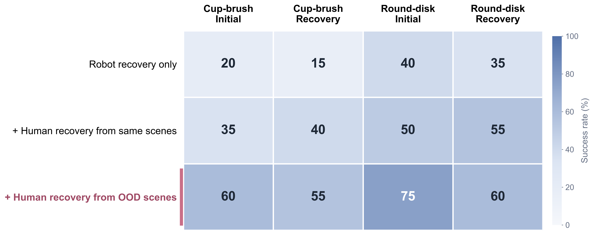

The robot data contains no out-of-domain (OOD) conditions. Human recovery is collected either in matched scenes or in new environments, with different objects, and under clutter; all models are evaluated under cluttered-object interference using robot observations only. OOD human recovery improves both tasks over robot-only recovery and same-scene human recovery. 
### Demonstrations under cluttered interference
<table><tr>
<td><strong>Other environment / human success</strong> </td>
<td><strong>Other environment / human recovery</strong> </td>
</tr><tr>
<td><strong>Different object / human success</strong> </td>
<td><strong>Different object / human recovery</strong> </td>
</tr><tr>
<td><strong>Clutter / human success</strong> </td>
<td><strong>Clutter / human recovery</strong> </td>
</tr><tr>
<td><strong>Cup-brush inference / 1</strong> </td>
<td><strong>Cup-brush inference / 2</strong> </td>
</tr><tr>
<td><strong>Round-disk inference / 1</strong> </td>
<td><strong>Round-disk inference / 2</strong> </td>
</tr></table>

## Response to Reviewer "2ftg" W2 & Q2, Reviewer "tMkX" Q4 & W2

###  Closed-loop mechanism ablation

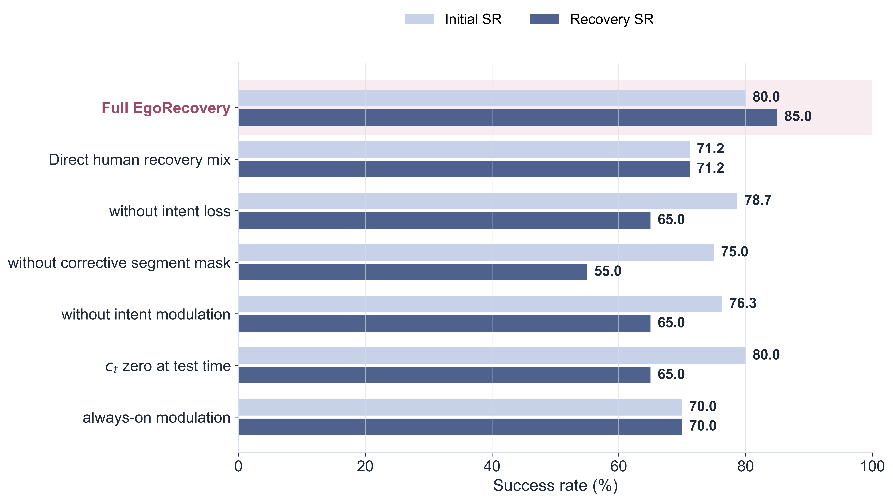

Removing intent modulation, or zeroing the predicted intent at test time, reduces Recovery SR to **65.0%** even when intent can still be predicted. The intent therefore needs a path to the executed robot action rather than serving only as an auxiliary target.

###  Corrective-intent target comparison

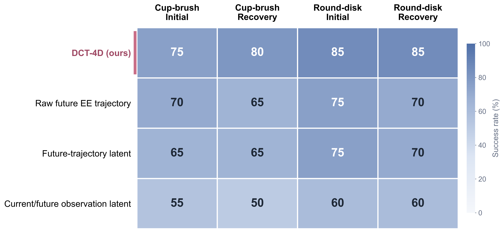

Only the intent-supervision target changes in this control; the gate, FiLM modulation, data, and training procedure are fixed. DCT-4D performs best across Initial and Recovery SR on both tasks, supporting a compact low-frequency magnitude representation rather than raw trajectories or learned observation/trajectory latents.

## Response to Reviewer "2ftg" W3 & Q1, Reviewer "VtdJ" Q7

### Redrawn Figure 6: Cost-matched and low-robot-grounding budgets

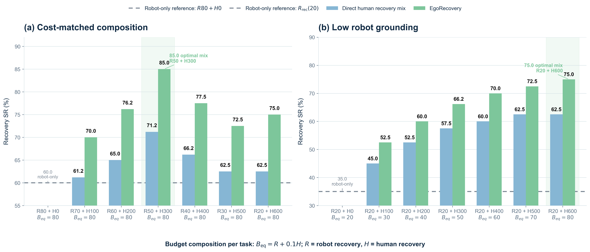

Panel (a) fixes the robot-equivalent recovery-collection budget at `B_RobotEq = R_rec + H_rec / 10 = 80`; the 50 robot-success episodes are fixed outside the budget. The moderate mixture `R_rec=50, H_rec=300` reaches **85.0% Recovery SR**, compared with **60.0%** for robot-only `R_rec=80, H_rec=0`. Panel (b) instead fixes a low robot-grounding set at `R_rec=20` and adds human recovery.The reported **10×** is a collection-throughput ratio, not a claim that 10× fewer training samples are required.

<!-- >###  Fixed-cost comparison

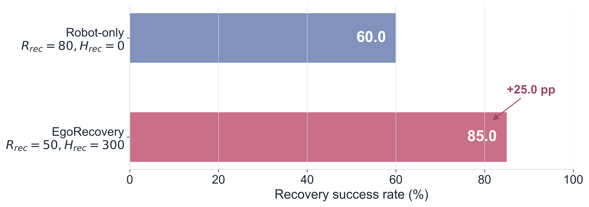

Both rows consume the same measured robot-equivalent recovery-collection cost. The mixed dataset improves Recovery SR by **25.0 percentage points**. -->

## Response to Reviewer "2ftg" W4, Reviewer "VtdJ" W & Q5

###  Recovery supervision versus success-only data

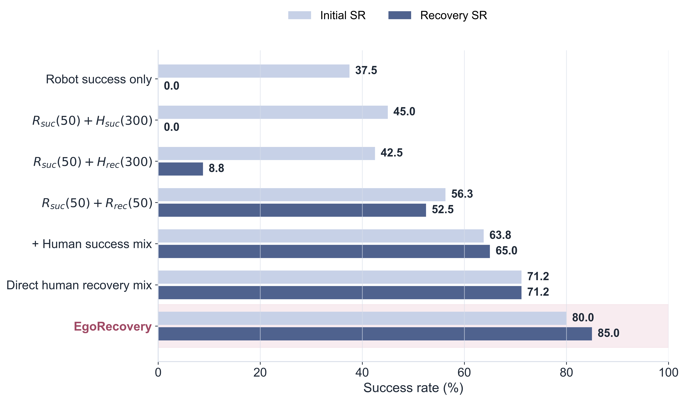

The first two rows show that robot success data alone and robot success plus 300 human-success demonstrations both obtain **0.0% Recovery SR** from staged failure starts. Human recovery without robot recovery grounding is also limited (**8.8%**); robot recovery raises Recovery SR to **52.5%**, and combining grounded robot recovery with the proposed pathway reaches **85.0%**.

###  Failure-state coverage

<table>
<tr>
<td align="center" width="50%">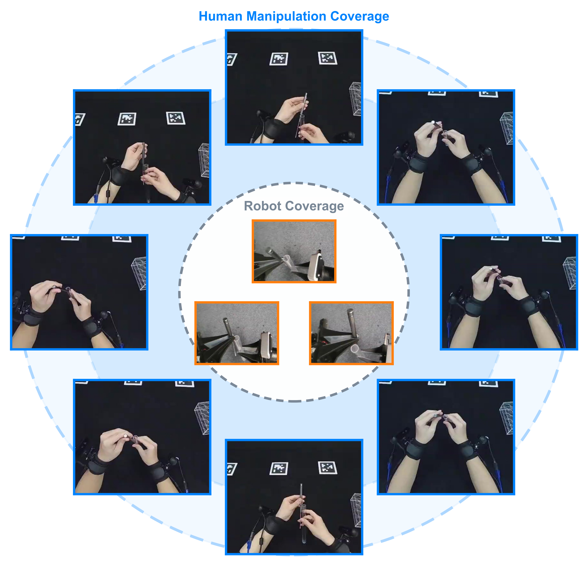</td>
<td align="center" width="50%">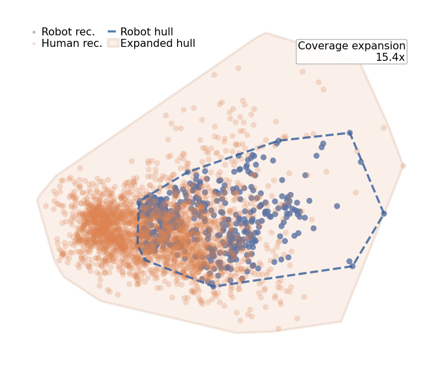</td>
</tr>
</table>

Representative frames and learned intent-feature distributions show that adding 300 human recovery episodes to 50 robot recovery episodes expands convex-hull volume by **15.4×**. 

## Response to Reviewer "VtdJ" Q6, Reviewer "tMkX" Q1

###  Test-time recovery-gate intervention

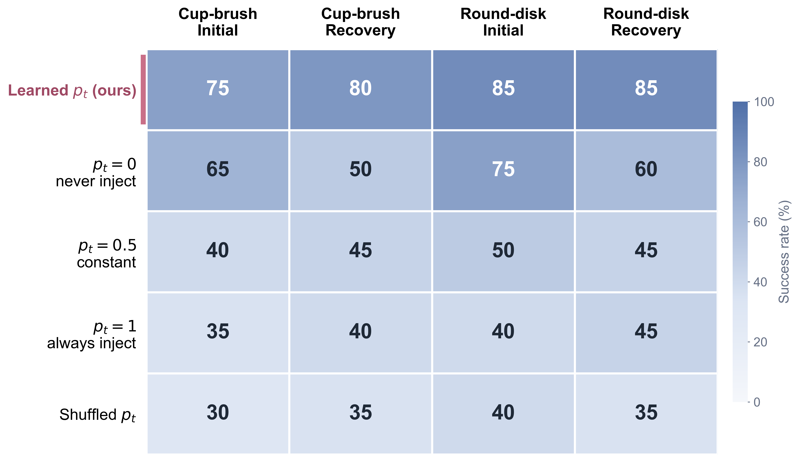

The same final checkpoint is evaluated without retraining while `p_t` is replaced by zero, a constant, one, or a shuffled sequence. Only the learned gate preserves both nominal execution and recovery.

### Closed-loop recovery-gate visualization from a failure start

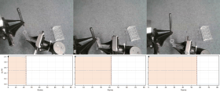

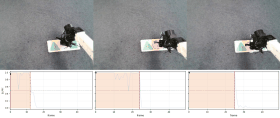

## Response to Reviewer "VtdJ" Q8

###  Recovery pathway with a Diffusion Policy head

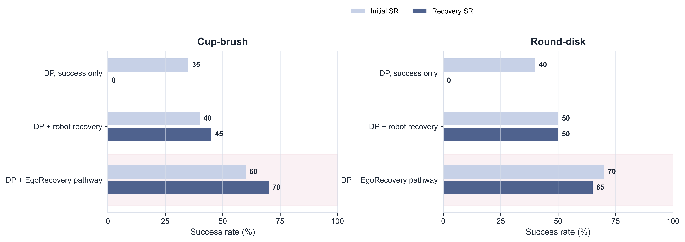

The action decoder is replaced by a Diffusion Policy head and evaluated in closed loop from the same off-nominal starts. Success-only Diffusion Policy obtains **0% Recovery SR** on both tasks; robot recovery helps, and the complete EgoRecovery pathway yields the strongest performance in this comparison.
### Demonstrations with DP backbone
<table><tr>
<td><strong>Cup-brush / 1</strong> </td>
<td><strong>Cup-brush / 2</strong> </td>
</tr><tr>
<td><strong>Cup-brush / 3</strong> </td>
<td><strong>Cup-brush / 4</strong> </td>
</tr><tr>
<td><strong>Round-disk / 1</strong> </td>
<td><strong>Round-disk / 2</strong> </td>
</tr><tr>
<td><strong>Round-disk / 3</strong> </td>
<td><strong>Round-disk / 4</strong> </td>
</tr></table>

## Response to Reviewer "VtdJ" Q4

###  Recovery-boundary annotation robustness

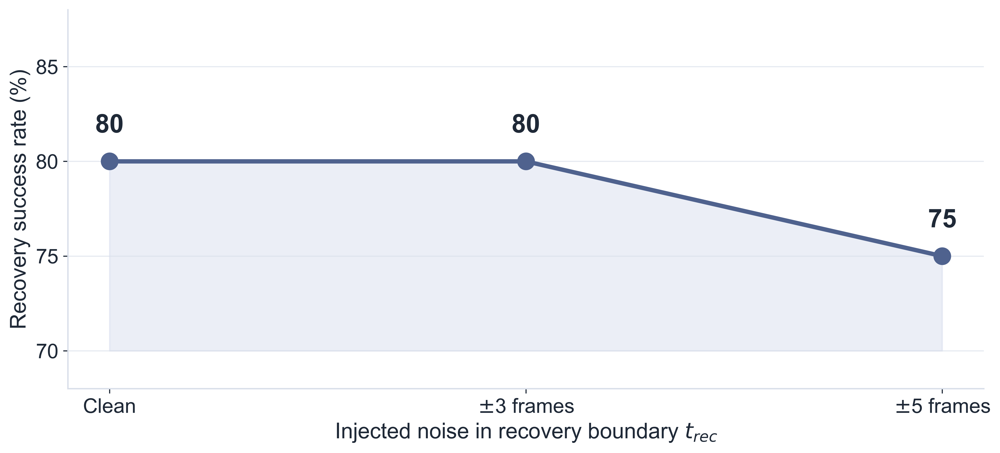

A motion-energy curve proposes `t_rec`, an annotator confirms or adjusts it, and the model is retrained after injecting boundary noise. Recovery SR is unchanged at ±3 frames and decreases by only 5 percentage points at ±5 frames.

## Response to Reviewer "tMkX" Q3 & W1

###  Multiple failure modes with one shared pathway

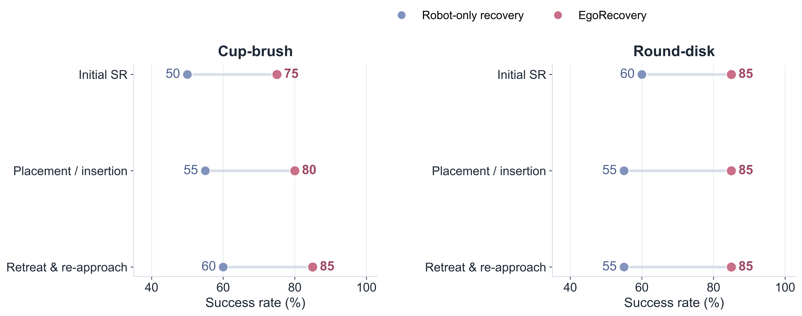

One model per task, with a shared gate and corrective-intent pathway, is trained across two distinct failure modes. EgoRecovery improves placement/insertion and retreat-and-re-approach recovery while preserving Initial SR.
### Multi-failure collection & inference
<table><tr>
<td><strong>Collection / Cup-brush / 1</strong> 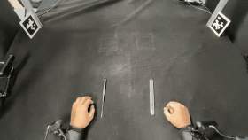</td>
<td><strong>Collection / Cup-brush / 2</strong> 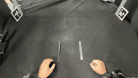</td>
</tr><tr>
<td><strong>Collection / Round-disk / 1</strong> 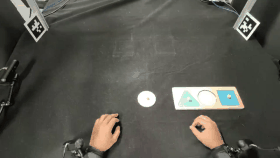</td>
<td><strong>Collection / Round-disk / 2</strong> 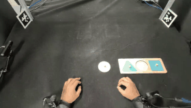</td>
</tr><tr>
<td><strong>Inference / Cup-brush / 1</strong> </td>
<td><strong>Inference / Cup-brush / 2</strong> </td>
</tr><tr>
<td><strong>Inference / Round-disk / 1</strong> </td>
<td><strong>Inference / Round-disk / 2</strong> 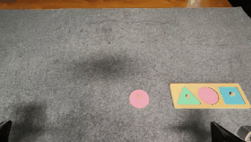</td>
</tr></table>

## Demonstrations

### Standard task demonstrations

#### Task 1 | Cup-brush insertion

<table><tr><th colspan="2">Collection</th></tr><tr>
<td><strong>Human success</strong> 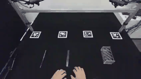</td>
<td><strong>Human recovery</strong> 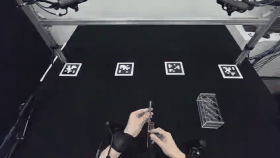</td>
</tr><tr><td><strong>Robot success</strong> 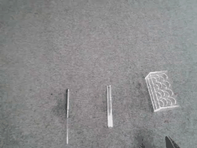</td>
<td><strong>Robot recovery</strong> 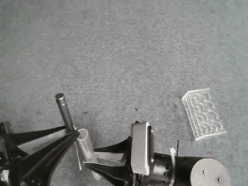</td>
</tr><tr><th colspan="2">Inference</th></tr><tr><td><strong>Recovery example 1</strong> </td>
<td><strong>Recovery example 2</strong> </td></tr></table>

#### Task 2 | Table sweep

<table><tr><th colspan="2">Collection</th></tr><tr>
<td><strong>Human success</strong> 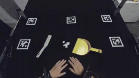</td>
<td><strong>Human recovery</strong> 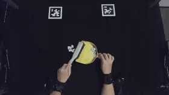</td>
</tr><tr><td><strong>Robot success</strong> 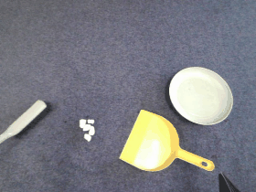</td>
<td><strong>Robot recovery</strong> 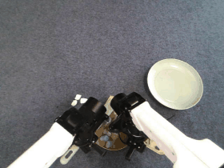</td>
</tr><tr><th colspan="2">Inference</th></tr><tr><td><strong>Recovery example 1</strong> </td>
<td><strong>Recovery example 2</strong> </td></tr></table>

#### Task 3 | Round-disk placement

<table><tr><th colspan="2">Collection</th></tr><tr>
<td><strong>Human success</strong> </td>
<td><strong>Human recovery</strong> 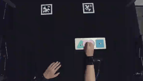</td>
</tr><tr><td><strong>Robot success</strong> 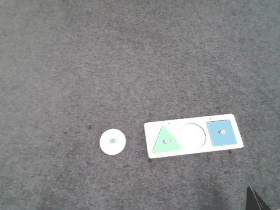</td>
<td><strong>Robot recovery</strong> 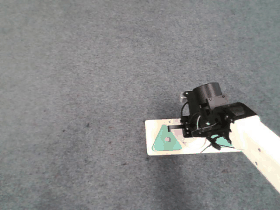</td>
</tr><tr><th colspan="2">Inference</th></tr><tr><td><strong>Recovery example 1</strong> 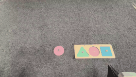</td>
<td><strong>Recovery example 2</strong> 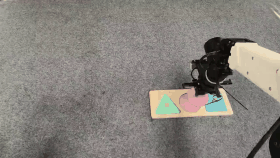</td></tr></table>

#### Task 4 | Cube stacking

<table><tr><th colspan="2">Collection</th></tr><tr>
<td><strong>Human success</strong> 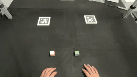</td>
<td><strong>Human recovery</strong> 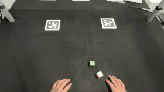</td>
</tr><tr><td><strong>Robot success</strong> 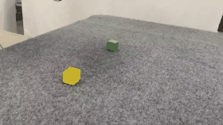</td>
<td><strong>Robot recovery</strong> 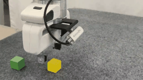</td>
</tr><tr><th colspan="2">Inference</th></tr><tr><td><strong>Recovery example 1</strong> </td>
<td><strong>Recovery example 2</strong> </td></tr></table>
